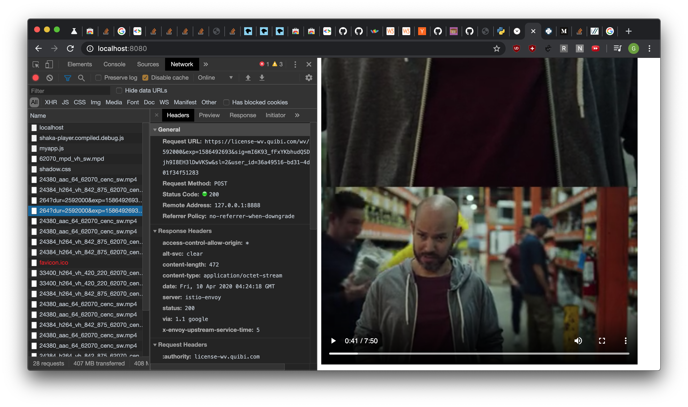

# wuibi
Wuibi is an unofficial web client (via WebExtensions) for the short lived streaming service [Quibi](https://quibi.com/).

Quibi only supported iOS/Android clients so I created this unofficial client. Quibi no longer exists, so this client no longer works.

The client supports basic search and playback functionality. Since I was much more interested in reversing and watching content, I didn't spend much time on the code so it's nowhere close to production quality.

The vast majority of code lives in [`src/index.js`](src/index.js). The (modified) reversed protos are in [`src/protos/protos.proto`](src/protos/protos.proto).

## How

I started by collecting packet captures for both the iOS and Android clients. Both clients used [Protocol Buffers](https://developers.google.com/protocol-buffers) over HTTP for API requests. iOS used HLS while Android used MPEG DASH. Since the iOS client also used [Fairplay Streaming DRM](https://developer.apple.com/streaming/fps/) which isn't supported on non-Apple devices, I decided to focus on the Android client for most of the project.

While I could have done a bunch of guesswork to reverse the protobufs, I wanted to see what I could find from the binaries. I decompiled the APK  using [Apktool](https://ibotpeaches.github.io/Apktool/) and [JD-GUI](http://java-decompiler.github.io/). 

Fortunately, the APK was compiled with full protobuf support which includes [File Descriptors](https://developers.google.com/protocol-buffers/docs/reference/java/com/google/protobuf/Descriptors). Descriptors describe the fields of a protobuf and are implemented as protobufs themselves!

After messing around with some [Java/protobuf string encoding issues](https://github.com/protocolbuffers/protobuf/blob/9637a3b57cacda57187ef48b08d4bc8f83349faf/java/core/src/main/java/com/google/protobuf/Descriptors.java#L317-L335) I was able to get binary serialized versions of all Quibi protobufs. Using a modified version of a [stack overflow answer](https://stackoverflow.com/a/19438512) I was able to recover all Quibi `.proto` files with human readable field names!

With the full API in hand, it was time to start implementing the custom web client. Since the client needed to make requests to Quibi, I implemented it as a WebExtension in order to bypass the same origin policy. The request flow was fairly straightforward: once authenticated, a `GetPlaybackInfoRequest` with the episode's id returned a `GetPlaybackInfoResponse` with the episode's `.mpd` manifests, auth info and a link to the license server.

The Android client used [Widevine DRM](https://en.wikipedia.org/wiki/Widevine) and I was nervous that it wouldn't play on Chrome/Firefox. Fortunately Quibi's license server supported the least secure DRM level (L3) and I had no issues playing the content.

Instead of implementing manifest management and directly dealing with DRM, I used the [Shaka Player](https://github.com/google/shaka-player) library. After providing the manifest, license server and auth information, everything worked!